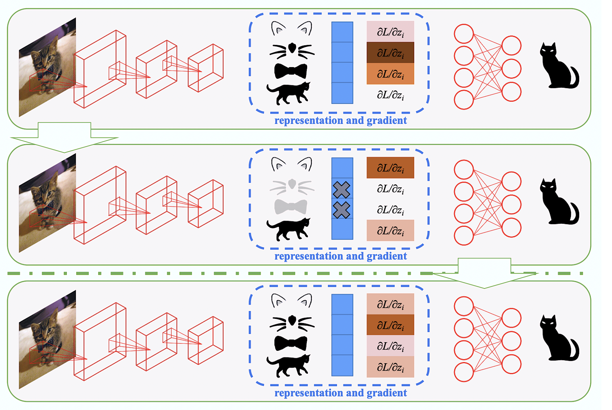

[](https://paperswithcode.com/sota/domain-generalization-on-office-home?p=self-challenging-improves-cross-domain)
[](https://paperswithcode.com/sota/domain-generalization-on-pacs-2?p=self-challenging-improves-cross-domain)
[](https://paperswithcode.com/sota/domain-generalization-on-vlcs?p=self-challenging-improves-cross-domain)

<h1 align="center"> ~ RSC-Wrapper ~ </h1>

Why do we want explainable AI in the first place? Because we actually don't really trust our trained models. And most of the time, we're entirely correct in that.

Especially for perception problems, modern "AI technologies" (naturally, I'm talking about our new/old ANNs) are capable of achieving marvelous results, never achieved and dreamt of before. However, the truth is that after the training phase, a network has a very superficial understanding of the observed data and not nearly as robust and deep as our inner brain representations. Moreover, that ultimately prevents generalizing to unseen data, data that have similar distribution but not identical to the one of the training set. And that, in my opinion, is one of the main challenges that, as a deep learning community, we're facing. It can be summarized in one word: **Domain Generalization**

With this repository, me, [Mauro](https://github.com/maurom3197) and [Simone](https://github.com/simoneangarano), wanted to share a TF.2x version of an idea that inspired our research. It has been presented with a paper entitled [Self-Challenging Improves Cross-Domain Generalization](https://arxiv.org/abs/2007.02454). It's far from being a perfect methodology, but it's a straightforward idea worth spreading. It can be seen as a regularizer, very similar to dropout and others, but that showed promising results in generalization and domain adaptation.

In contrast to the authors and their [official repository](https://github.com/DeLightCMU/RSC), we made a simple wrapper that takes as input whichever backbone and a classification head for feature extraction and classification, respectively. The following guide will give you some simple instructions on how to use it. We hope it can inspire you great thoughts as it's inspired us. Enjoy :)

<p align="center">
  
</p>

# 1.0 Getting Started

## 1.1 Installation
# 1.0 Getting Started

## 1.1 Installation
Python3 and Tensorflow 2.x are required and should be installed on the host machine following the [official guide](https://www.tensorflow.org/install). 

1. Clone this repository
   ```bash
   git clone https://github.com/EscVM/RSC-Wrapper
   ```
2. Install the required packages
   ```bash
   pip3 install -r requirements.txt
   ```
Peek inside the requirements file if you have everything already installed. Most of the dependencies are common libraries.

# 2.0 Use the RSC-Wrapper
Let's see how to use the RSC-Wrapper and train your neural network with RSC regularizer.

First of all let's create a backbone
```python3
backbone = tf.keras.applications.ResNet50(include_top=False, weights='imagenet',input_shape=config['input_shape'])
```
and a classification head:
```python3
class_head = tf.keras.models.Sequential([tf.keras.layers.Dense(512*4),
                                         tf.keras.layers.Dense(7)]) # no softmax
```

Than, let's create the wrapper for our model:
```python3
model = RSCModelWrapper(backbone, class_head, 
                        trainable_backbone=True, 
                        percentile=config["percentile"], batch_percentage=config["batch_percentage"])
```


That's it, you are good to go. You can now compile your model and fit like an ordinary and boring TensorFlow model. The wrapper takes care of training your model with the RSC regularizer.

Compile and fit methods are nearly identical to the common ones, except for some additional attributes. For example, the compile method can input a function with a tf.data pipeline for custom pre-processing of your training data.

# 3.0 Example Notebooks

In the main folder, you can also find two example notebooks: one that trains an EfficientNet based NN on the simple Cats-vs-Dogs dataset and a second one that lets you train a NN over the famous PACS dataset.


